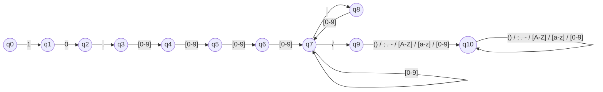

# M1 - Linguagens Formais e Autômatos

## DOI - Digital Object Identifier

### 1. Gramática Regular
Ls = {-,.,_,;,(),/} <br>
Ln = {0,1,2,3,4,5,6,7,8,9} <br>
La = {a, b, c, d, e, f, g, h, i, j, k, l, m, n, o, p, q, r, s, t, u, v, w, x, y, z} <br>
Lam = {A, B, C, D, E, F, G, H, I, J, K, L, M, N, O, P, Q, R, S, T, U, V, W, X, Y, Z} <br>

S -> 10.LnLnLnLnA<br>
A -> LnA | .LnA | B
B -> /C <br>
C -> LnC | LsC | LaC | LamC | ε <br>

### 2. Expressões regulares
```^10\.\d{4}(\d|\.\d)*\/[a-zA-Z0-9\-._;()\/]+$```

### 3. AFD - Autômato Finito Determinístico


### 4. Tabela de Transição
|     a     |  1 |  0 |  . | 0-9 |  / | () / ; . - / [A-Z] / [a-z] / [0-9] |
|:---------:|:--:|:--:|:--:|:---:|:--:|:----------------------------------:|
| &rarr; q0 | q1 |  - |  - |  -  |  - |                  -                 |
|     q1    |  - | q2 |  - |  -  |  - |                  -                 |
|     q2    |  - |  - | q3 |  -  |  - |                  -                 |
|     q3    |  - |  - |  - |  q4 |  - |                  -                 |
|     q4    |  - |  - |  - |  q5 |  - |                  -                 |
|     q5    |  - |  - |  - |  q6 |  - |                  -                 |
|     q6    |  - |  - |  - |  q7 |  - |                  -                 |
|     q7    |  - |  - | q8 |  q7 | q9 |                  -                 |
|     q8    |  - |  - |  - |  q7 |  - |                  -                 |
|     q9    |  - |  - |  - |  -  |  - |                 q10                |
|   * q10   |  - |  - |  - |  -  |  - |                 q10                |

### 5. Páginas Web  


### Referências
1. https://www.crossref.org/documentation/member-setup/constructing-your-dois/
2. https://www.doi.org/doi-handbook/DOI_Handbook_Final.pdf
3. https://wp.scielo.org/wp-content/uploads/orientacao_doi.pdf
